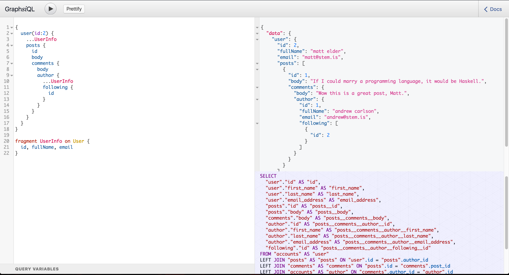

GraphsiQL
========

*/ˈɡrafsək(ə)l/* A custom version of GraphiQL for [Join Monster](https://github.com/stems/join-monster).
[Try the live demo](https://join-monster.herokuapp.com/graphql).

To serve it, I suggest using [koa-custom-graphiql](https://github.com/stems/koa-custom-graphiql).



### Usage

```javascript
import path from 'path'
import koa from 'koa'
import koaRouter from 'koa-router'
import graphqlHTTP from 'koa-graphql'
// module we created that lets you serve a custom build of GraphiQL
import graphiql from 'koa-custom-graphiql'
import koaStatic from 'koa-static'

// import your schema definition
import schema from './schema/index'

const app = koa()
const router = koaRouter()

// give koa-custom-graphiql the URLs for the JS and CSS
router.get('/graphql', graphiql({
  css: '/graphiql.css',
  js: '/graphiql.js'
}))

// serve your GraphQL API endpoint
router.post('/graphql', graphqlHTTP({
  schema,
  formatError: e => {
    console.error(e)
    return e
  }
}))

app.use(router.routes())
// serve the custom build of GraphiQL
app.use(koaStatic(path.resolve(require.resolve('graphsiql'), '..', '..')))

app.listen(3000, () => console.log('server listening at http://localhost:3000/graphql'))
```

How do I get the SQL to appear in the bottom-right-hand window? This window looks for a specific **header** in the HTTP response. Just set `x-sql-preview` to the SQL you want to display. Make sure to URI encode characters that cannot be in a header, such as newlines.
